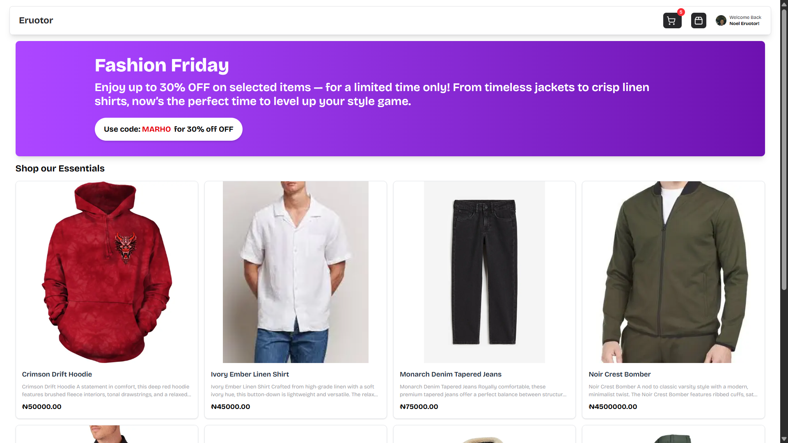

# 🛍️ Simple Sanity E-commerce Website

A minimal e-commerce website built with **Next.js**, styled using **Tailwind CSS**, powered by **Sanity CMS** for content management, with **Clerk** for user authentication. Smooth animations via **Framer Motion** and deployed on **Vercel**.

---

## 🔧 Tech Stack

- **Next.js** – React framework
- **Tailwind CSS** – Utility-first CSS framework
- **Sanity.io** – Headless CMS for product data
- **Clerk** – User authentication
- **Framer Motion** – Animations and transitions
- **Vercel** – Hosting and deployment

---

## ✨ Key Features

- 🔐 Simple login/signup with Clerk
- 📦 Products managed from Sanity Studio
- 🛒 Add-to-cart functionality
- 📱 Mobile-responsive design
- 💫 Smooth animations using Framer Motion

---

## ▶️ Getting Started

1. **Clone the repo**
   ```bash
   git clone https://github.com/noeljr2306/sanity-ecommerce-website.git
   cd sanity-ecommerce-website
Install dependencies

bash
Copy
Edit
npm install
Set environment variables in .env.local

---

## 🧪 Environment Variables

Create a `.env.local` file in the root of the project and add the following:

```env
NEXT_PUBLIC_SANITY_PROJECT_ID=your_project_id
NEXT_PUBLIC_SANITY_DATASET=production
NEXT_PUBLIC_BASE_URL=http://localhost:3000

NEXT_PUBLIC_CLERK_PUBLISHABLE_KEY=your_clerk_publishable_key
CLERK_SECRET_KEY=your_clerk_secret_key

SANITY_API_TOKEN=your_sanity_token
SANITY_API_READ_TOKEN=your_sanity_read_token

STRIPE_SECRET_KEY=your_stripe_secret_key
STRIPE_WEBHOOK_SECRET=your_stripe_webhook_secret

```
Run the development server

bash
Copy
Edit
npm run dev
Visit http://localhost:3000

🖼️ Preview


📦 Deployment
Deployed on Vercel
Automatically builds and redeploys on every push.

💡 Notes
This project is a simple demonstration of:

Sanity for managing product content

Clerk for basic auth

A clean and responsive UI with TailwindCSS

Nice entry animations with Framer Motion

